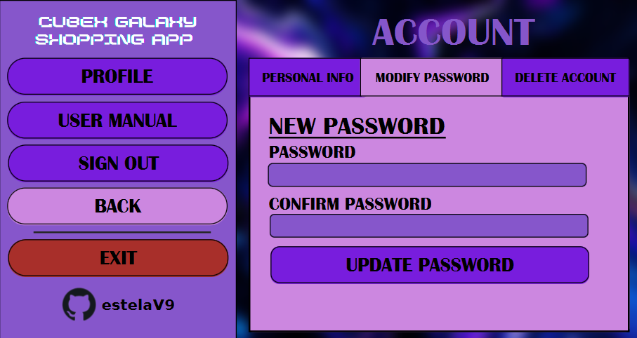

# PRÁCTICA FORMULARIO EN JAVAFX
## Introducción al ejercicio
Desarrollar una aplicación JavaFX con mínimo dos formularios y dos tablas en la base de datos.

## CubeX Galaxy Shopping App
<table>
  <tr>
    <td width="30%">
     <a href="https://github.com/estelaV9/AccesoADatos/tree/master/Tema1_AccesoBDRelacionales/EjercicioFormularioFX" target="_blank">
        
      </a>
    </td>
    <td width="70%">
        <b>CubeX Galaxy</b> es una aplicación desarrollada en JavaFX, que simula el funcionamiento de una tienda online especializada en cubos de Rubik. 
      <br> <br>
      El objetivo de esta práctica es practicar el manejo de formularios y manejo de datos en JavaFX, además de crear un entorno visual e interactivo.
    </td>        
 </tr>
</table>

### Características Principales
 - **Creación de cuentas de usuario**: Los usuarios pueden registrarse en la aplicación creando una cuenta con su información personal.
 - **Iniciar sesión y modificar datos**: Los usuarios pueden iniciar sesión en la aplicación, gestionar sus datos y actualizar su información personal.
 - **Catálogo de productos**: La aplicación ofrece un catálogo de cubos de Rubik disponibles para comprar, con detalles como nombre, precio y la opción de añadir al carrito.
 - **Gestión de productos**: La aplicación permitirá a los usuarios registrados crear y gestionar productos dentro del catálogo.
 - **Carrito de compras**: Los usuarios podrán seleccionar productos y agregarlos al carrito, visualizar el total y proceder a la compra.

### Ejecución del proyecto
Este proyecto no tiene el archivo module, por lo que, la ejecución tiene que añadirse a mano.
1. En la ventana superior, ir a RUN > Edit Configuration.
2. Aparecerá una ventana con nuestras configuraciones, añadiremos una configuración.
3. Vincularemos que el main class sea el nombre de nuestra clase main.
4. Modify options > Add VM option
5. En el apartado que nos saldra pondremos lo siguiente:
   ```java
   --module-path "C:\(ruta donde tengas el sdk de javafx)\lib" --add-modules javafx.controls,javafx.fxml
   ```
6. Ejecutarás el sql y cambiarás los datos de properties por los datos que tu tengas.
6. Una vez terminados estos pasos, podrás ejecutar la app. ¡Disfruta!


### Visión General de la Aplicación
#### INICIO
<table>
  <tr>
    <td width="70%">
        La aplicación se abre con el logo de <b>CUBEX GALAXY SHOPPING APP</b>, unas palabras introductivas y <br> un botón "Go!" que llevará a la página para registrarse o iniciar sesión. 
    </td>
    <td width="30%">
      
    </td>            
 </tr>
</table>

#### REGISTRARSE
<table>
  <tr> 
    <td>
      INICIAR SESIÓN
    </td>
    <td>
      CREAR UNA CUENTA
    </td>
    <td>
      DESCRIPCIÓN
    </td>
  </tr>
  <tr>
    <td width="33%">
        
    </td> 
    <td width="33%">
        
    </td>
    <td>
      Elige cómo quieres registrarte : <b>iniciando sesión</b> o <b>creando una cuenta</b>.  <br> <br>
      Tendrás a disposición un <b>botón "<-"</b> para volver al inicio de la aplicación y otro botón para <b>salir</b> de la aplicación. <br><br>
      Cuando te hayas registrado te llegará directamente a la tienda.
    </td>
 </tr>
</table>

#### TIENDA
<table>
  <tr>
     <td width="60%">
      Al entrar en esta página, se te mostrará, en forma de una tabla, todos los productos que están publicados. <br> <br>
      Dispondrás de tres botones en la parte superior del panel: <br>
        - <b>···</b>: Te desplegará el menú de ajustes, donde podras redirigirte a la página de ajustes, cerrar sesión o simplemente cerrar el menú. <br>
        - <b>New product</b>: Te llevará a la página de <b>Your Products</b> con un panel para crear un producto.<br>
        - <b>Your Products</b>: Redirigirá a la página donde tendrás tus productos.<br> <br>
      Seguirás teniendo a disposición los botones adiccionales de <b>"<-"</b> para volver al registro y otro <b>salir</b> de la aplicación.
    </td>
    <td width="40%">
      <p> TIENDA SIN MENÚ</p>
        
      <p> TIENDA CON MENÚ</p>
      
    </td>    
 </tr>
</table>

#### YOUR PRODUCTS
<table>
  <tr>
    <td width="40%">
      <p> TUS PRODUCTOS</p>
        
      <p> CREAR UN PRODUCTO</p>
      
      <p> MODIFICAR UN PRODUCTO</p>
      
    </td> 
    <td width="60%">
      Al igual que en la página <b>tienda</b>, se te mostrará, en forma de una tabla, todos los productos que has publicado. <br> <br>
      Si pulsaste en tienda el boton <b>New Product</b>, te saldrá el panel a rellenar para crear un nuevo producto. Cuando termines se actualizará la tabla con tus productos publicados. <br><br>
      Si pulsas un producto de tu tabla, te saldrá el panel para modificar el producto seleccionado. Al igual que con <b>New Product</b>, se actualizará la tabla con el producto modificado. <br>
      Además, en este mismo panel, habrá una opción para <b>eliminar</b> el producto. <br><br>
      Seguirás teniendo a disposición los botones adiccionales de <b>"<-"</b> para volver a la tienda y otro <b>salir</b> de la aplicación.
    </td>
 </tr>
</table>

#### SETTINGS
<table>
  <tr>
     <td width="60%">
      Cuando pulsas la opción de <b>settings</b>, te abrirá una ventana con varias opciones: <br><br>
      - <b>PROFILE</b>: Aparecerá un panel sobre la cuenta del usuario con tres opciones:
         · <b>Editar información</b>: cambiará la información sobre el nombre y el mail del usuario. Una vez finalizado, se "reiniciará" y le llevará a la página de resgistrarse.
       · <b>Editar contraseña</b>: cambiará la información de la contraseña del usuario.
       · <b>Eliminar Usuario</b>: se eliminará el usuario de forma inmediata. Redirigirá a la página de registro.
      - <b>User Manual</b>: Nos llevará a este archivo.
      - <b>Sign Out</b>: Cerrará sesión.
      - <b>Back</b>: Volverá a la página de tienda.
      - <b>Exit</b>: Cerrará la aplicación.
      - <b>estelaV9</b>: Redirigirá a mi github.
    </td>
    <td width="40%">
      <p>PROFILE SETTINGS</p>
        
      <p>PASSWORD SETTINGS</p>
      
      <p>DELETE SETTINGS</p>
      
    </td>    
 </tr>
</table>
<br>


---
<div align="center">
  <h2>¡Disfruta de la Práctica!</h2>
</div>

>_IES Ribera de Castilla 24/25._
