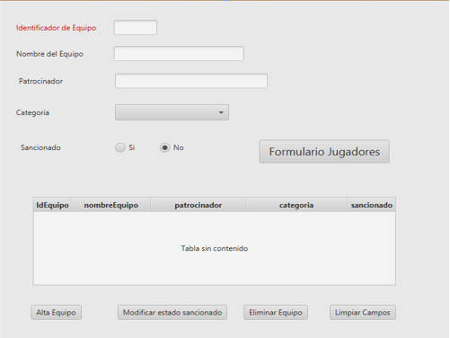
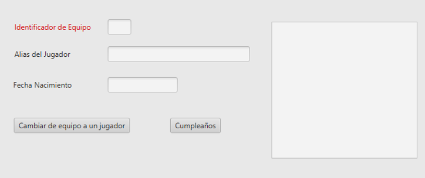

# Ejercicio Adicional Trabajando Con Los Tres Gestores de Base de Datos
## Enunciado
Realizar una <a href="">aplicación</a> para gestionar una liga de futbol para un instituto. De momento solo queremos controlar los equipos y jugadores que pertenecen a cada equipo. <br>
Realizaar las siguientes funciones utilizando `Hibernate (1 a N)` y `MongoDB`: <br>

1. Los datos en el `Combo Box` se cargarán del fichero Json **“Categorias”** solo se cargará el nombre.
2. Al cargase el formulario, se deberán cargar en el `TableView` los datos de todos los equipos, utilizando para ello **Hibérnate**. Al pulsar en el `TableView` sobre un equipo se cargarán los datos seleccionados en los `TextField` correspondientes. 
3. Al pulsar el botón `Alta Equipo`, se deberán dar de Alta un equipo en **MongoDB y en MySQL**. Primero se pulsará el botón `Limpiar Campos` para posteriormente una vez introducidos pulsar el `Botón Alta Equipo` para insertarlo en los 2 SGBD.
4. Se puede modificar el estado de sanción de un equipo. Primero se seleccionar el `estado` al que se  quiere cambiar de equipo, una vez seleccionado el estado , se pulsara sobre el botón `Modificar estado sancionad`o y se modificara el estado del equipo en la BD . Esta operación se hará utilizando **Hibérnate**.
5. Se podrá `dar de baja`(borrar) un equipo por diferentes motivos. Al pulsar sobre el botón `Eliminar` equipo se borrará el equipo que está actualmente en los campos de los `TextField`. Se utilizará para esta opción **Hibérnate y MongoDB**.



Al pulsar sobre el botón `Formulario Jugadores`:
1. Se cargará el formulario de los jugadores del equipo que estaba seleccionado. Al inicializarse este formulario se debe cargar en el ListView el alias del jugador y la fecha de nacimiento de todos los jugadores de ese equipo. Cuando pulsemos sobre un jugador sus datos se cargarán en los `Text Field` correspondientes. **Hibernate**
2. Sobre este formulario solo se podrán hacer 2 cosas: (**Hibernate**)
   - **Cambiar a un jugador de equipo**, para lo cual modificando el identificador de equipo y pulsando del botón `Cambiar` de equipo a un jugador, al jugador seleccionado se le habrá cambiado de equipo, por tanto, deberá desaparecer del `ListView` y los campos se ponen en blanco. Si el equipo al que se intenta cambiar no existiera nos debería mostrar un mensaje de `ERROR`.
   - **Cumpleaños**, al pulsar sobre este botón me mostrara en un `alert` el nombre de los jugadores que es su **cumpleaños en el día de hoy y cuantos años cumplen**.




### Scripts
#### Dependencias del Fichero Pom.xml
```xml
<dependencies>
    <dependency>
        <groupId>org.openjfx</groupId>
        <artifactId>javafx-controls</artifactId>
        <version>20-ea+4</version>
    </dependency>
    <dependency>
        <groupId>org.openjfx</groupId>
        <artifactId>javafx-fxml</artifactId>
        <version>20-ea+4</version>
    </dependency>
    <dependency>
        <groupId>org.controlsfx</groupId>
        <artifactId>controlsfx</artifactId>
        <version>11.1.2</version>
    </dependency>

    <dependency>
        <groupId>org.kordamp.bootstrapfx</groupId>
        <artifactId>bootstrapfx-core</artifactId>
        <version>0.4.0</version>
    </dependency>
    <dependency>
        <groupId>org.junit.jupiter</groupId>
        <artifactId>junit-jupiter-api</artifactId>
        <version>${junit.version}</version>
        <scope>test</scope>
    </dependency>
    <dependency>
        <groupId>org.junit.jupiter</groupId>
        <artifactId>junit-jupiter-engine</artifactId>
        <version>${junit.version}</version>
        <scope>test</scope>
    </dependency>
    <dependency>
        <groupId>org.hibernate</groupId>
        <artifactId>hibernate-core</artifactId>
        <version>5.6.9.Final</version>
    </dependency>
    <dependency>
        <groupId>mysql</groupId>
        <artifactId>mysql-connector-java</artifactId>
        <version>8.0.29</version>
    </dependency>
    <dependency>
        <groupId>com.google.code.gson</groupId>
        <artifactId>gson</artifactId>
        <version>2.9.1</version>
    </dependency>

    <dependency>
        <groupId>org.mongodb</groupId>
        <artifactId>mongodb-driver</artifactId>
        <version>3.12.11</version>
    </dependency>

    <dependency>
        <groupId>com.fasterxml.jackson.core</groupId>
        <artifactId>jackson-core</artifactId>
        <version>2.15.3</version>
    </dependency>
    <dependency>
        <groupId>com.fasterxml.jackson.core</groupId>
        <artifactId>jackson-databind</artifactId>
        <version>2.12.1</version>
    </dependency>
</dependencies>
```

#### Categoria.json
```json
[
    {
        "nombre": "Formación Profesional",
        "abreviatura": "FP"
       
    },
    {
        "nombre": "Bachillerato",
        "abreviatura": "B",
        "edad": 90,
        "carnet": false
    },
    {
        "nombre": "Educacion Secundaria Obligatoria",
        "abreviatura": "ESO"
        
    },
    {
        "nombre": "Profesores",
        "apellidos": "P"
       
    }
]
```

#### SQL
```sql
DROP DATABASE IF  EXISTS EquiposDB;
CREATE DATABASE  EquiposDB;
USE EquiposDB;

CREATE TABLE  equipos
(
	idEquipo INT  PRIMARY KEY AUTO_INCREMENT,
	nombreEquipo VARCHAR(50) UNIQUE NOT NULL,
	patrocinador VARCHAR(50),
	categoria VARCHAR(50),
    sancionado BOOLEAN
);
insert into equipos values(1,"Robin Hood","Coca cola","Educacion Secundaria Obligatoria",false),
(2,"Carabobo","Red Bull","Formación Profesional",false),
(3,"Abuelos F.C","Mercadona","Profesores",true),
(4,"Rico Pollo","Carrefour","Bachillerato",false),
(5,"Correcaminos","Estrella Galicia","Formación Profesional",false);


CREATE TABLE  jugadores
(
	idJugador INT  PRIMARY KEY AUTO_INCREMENT,
	aliasJugador VARCHAR(50) NOT NULL,
	fechaNacimiento Date NOT NULL,
	id_equipo INT  REFERENCES equipos
);

insert into jugadores values
(1,"Juanito Bananas","1999-11-11",1),
(2,"Luis el Rubio","2005-11-10",2),
(3,"Jaimito el gorrilla","1999-11-11",1),
(4,"Ruben el pastelero","1995-11-15",5),
(5,"Daniel el guapo","1996-11-11",5),
(6,"Javier el pelao","1995-9-11",2),
(7,"David el nomo","1998-10-11",4),
(8,"Mario el pelota","1995-3-16",4),
(9,"Roberto monedero","2001-12-11",1),
(10,"Josete el flaco","1999-6-11",2);
```

#### MondoDB
Crear una base de datos con el nombre `EquiposDB` y el nombre de la coleción `Equipos`.
```bash
db.Equipos.insertMany(
  [
    {
      idEquipo: 1,  
      nombreEquipo: 'Robin Hood',
      patrocinador: 'Coca cola',
      categoria : 'Educacion Secundaria Obligatoria',
     sancionado:true
      
    },
    {
      idEquipo: 2,  
      nombreEquipo: 'Carabobo',
      patrocinador: 'Red Bull',
      categoria : 'Formación Profesional',
     sancionado:false
      
    },
{
      idEquipo: 3,  
      nombreEquipo: 'Abuelos F.C',
      patrocinador: 'Mercadona',
      categoria : 'Profesores',
     sancionado:true
      
    },
{
      idEquipo: 4,  
      nombreEquipo: 'Rico Pollo',
      patrocinador: 'Carrefour',
      categoria : 'Bachillerato',
     sancionado:false
      
    },
{
      idEquipo: 5,  
      nombreEquipo: 'Correcaminos',
      patrocinador: 'Estrella Galicia',
      categoria : 'Formación Profesional',
     sancionado:false
      
    }
  ]
)
```

### Nota del ejercicio:
<table>
  <tr>
    <th>
      Nota:
    </th>
  </tr>
  <tr>
    <td>
      x
    </td>
  </tr>
</table>

---
<div align="center">
  <h2>¡Disfrute el ejercicio!</h2>
</div>

>_IES Ribera de Castilla 24/25._
