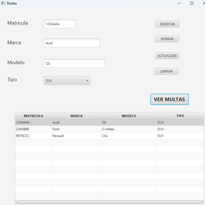
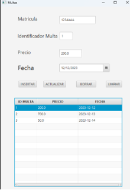

# Ejercicio Hibernate con Relación 1N
## Introducción
Partiendo del <a href="https://github.com/estelaV9/AccesoADatos/tree/master/Tema4_MapeoObjetoRelacional_Hibernate/PracticaHibernate_CRUDCoches/EstelaDeVega_CrudCochesHibernate">ejercicio anterior</a> de la **Gestión de Coches**, realizar una <a href="https://github.com/estelaV9/AccesoADatos/tree/master/Tema4_MapeoObjetoRelacional_Hibernate/PracticaHibernate1N_CocheMulta/EstelaDeVega_CocheMultaHibernate">aplicación</a> añadiendo una relación 1N con `Multas` usando **Hibernate**.

## Enunciado
### Coches
Realizar aplicación CRUD de gestión de coches para trabajar con Hibernate. <br><br>
OBLIGATORIO: utilizar al menos un ComboBox y un TableView.<br><br>
En el TableView se deberá ver en todo momento los documentos que existan en la colección. Cuando se haga alguna modificación, borrado o inserción de documentos el TableView se deberá actualizar.<br><br>
Además, se deberá crear una clase Validar con todos sus métodos estáticos para validar algunos de los campos de tu formulario.<br><br>

<table>
  <tr>
    <th>
      El formulario para la práctica puede ser como el de la imagen:
    </th>
    <th>
      Mi aplicación:
    </th>
  </tr>
  <tr>
    <td>
       
    </td>
    <td>
      
    </td>
  </tr>
</table>

### Multas
Cuando pulse sobre el botón Ver Multas , nos mostrara el siguiente formulario para manipular las multas de ese coche.

<table>
  <tr>
    <th>
      El formulario para las multas puede ser como el de la imagen:
    </th>
    <th>
      Mi aplicación:
    </th>
  </tr>
  <tr>
    <td>
       
    </td>
    <td>
      
    </td>
  </tr>
</table>


## Script SQL
```sql
DROP DATABASE IF EXISTS Multas;
CREATE DATABASE Multas;
USE Multas;
CREATE TABLE coches (
  id integer NOT NULL AUTO_INCREMENT,
  matricula varchar(50) DEFAULT NULL,
  marca varchar(50) DEFAULT NULL,
  modelo varchar(50) DEFAULT NULL,
  tipo varchar(50) DEFAULT NULL,
  PRIMARY KEY (id)
)  ENGINE=InnoDB  DEFAULT CHARSET=utf8mb4 AUTO_INCREMENT=1 ;

INSERT INTO coches (matricula, marca, modelo, tipo)
VALUES ('1234AAA', 'Audi', 'Q5', 'SUV'),
 ('2345BBB', 'Ford', 'S-mMax', 'SUV'),
 ('9876CCC', 'Renault', 'Clio', 'SUV');


CREATE TABLE IF NOT EXISTS multas (
  id_multa integer unsigned NOT NULL AUTO_INCREMENT,
  precio DOUBLE NOT NULL,
  fecha DATE DEFAULT NULL,
  matricula varchar(7) NOT NULL,
  PRIMARY KEY (id_multa)
  ) ENGINE=InnoDB  DEFAULT CHARSET=utf8mb4 AUTO_INCREMENT=1 ;


INSERT INTO Multas (matricula, precio, fecha)
VALUES ('1234AAA', 200, '2023-12-12'),
       ('1234AAA', 700, '2023-12-13'),
       ('1234AAA', 50, '2023-12-14'),
       ('2345BBB', 250, '2024-12-01'),
        ('9876CCC', 100, '2024-11-21');
```

---
>_IES Ribera de Castilla 24/25._
